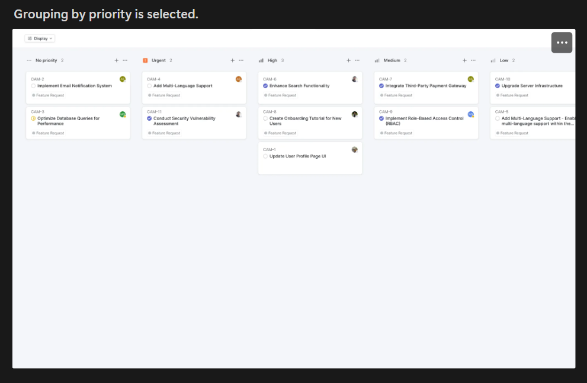
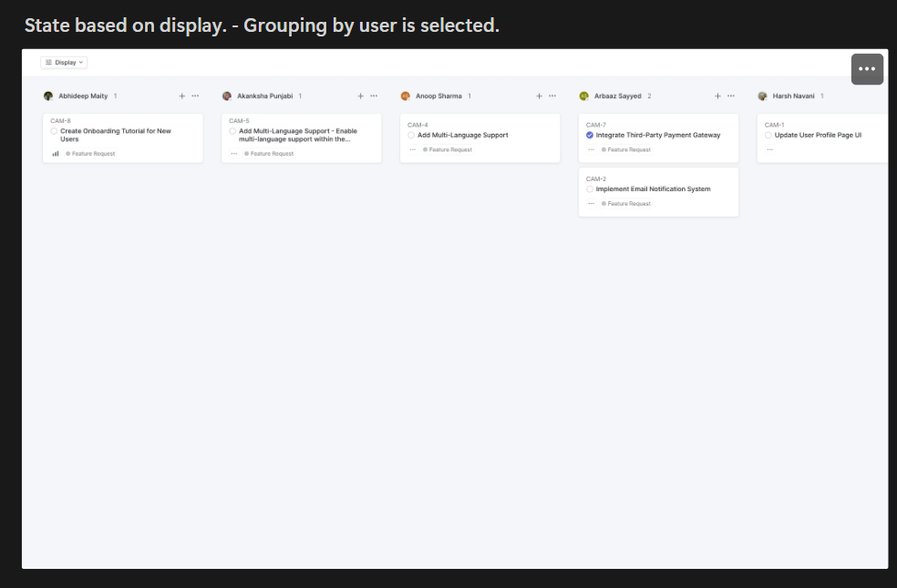
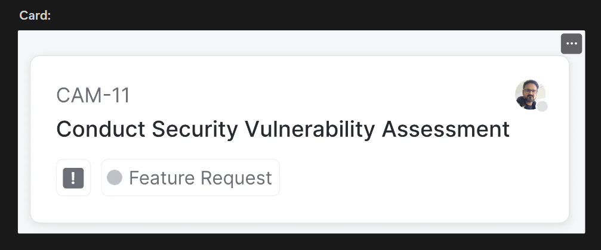

# Frontend Assignment - Interactive Kanban Board Application

## **Image Table**

Given:

| Image 1                            |
| ---------------------------------- |
|  |

| Image 2                            |
| ---------------------------------- |
|  |

| Image 3                            |
| ---------------------------------- |
|  |

| Image 4                            |
| ---------------------------------- |
|  |

---

## Assignment Task

You are required to create an interactive Kanban board application using React JS that interacts with the provided API from the following link:

[Assignment Task](https://quicksell.notion.site/Frontend-Assignment-5288a76c8adc4214be36e488d086adc6)

---

## **API Endpoint**

`https://api.quicksell.co/v1/internal/frontend-assignment`

This API provides the data required for creating the Kanban board.

---

## **Kanban Board Features**

Your task is to develop an interactive Kanban board application with the following features:

### 1. **Grouping Options:**

- **By Status**: Group tickets based on their current status.
- **By User**: Arrange tickets according to the assigned user.
- **By Priority**: Group tickets based on their priority level.

### 2. **Sorting Options:**

- **By Priority**: Sort tickets in descending order of priority.
- **By Title**: Sort tickets in ascending order based on their title.

### 3. **User Experience:**

- When a user clicks the "Display" button and selects a grouping option, the Kanban board should dynamically adjust to reflect the chosen grouping.
- The application should save the user's view state so that it remains consistent even after a page reload.

---

## **Priority Levels:**

The priority levels for the tickets, as received from the API, are as follows:

| Priority Level | Description |
| -------------- | ----------- |
| 4              | Urgent      |
| 3              | High        |
| 2              | Medium      |
| 1              | Low         |
| 0              | No priority |

---

## **Design and Assets**

The Kanban board should be visually appealing and responsive, with a design similar to the provided screenshots.

---

## **Evaluation Criteria**

Your project will be evaluated based on the following:

1. **Functionality:** Does the application effectively fetch data from the API and allow the user to group and sort tickets?
2. **Visual Design:** Is the UI similar to the provided screenshots in terms of layout and aesthetics?
3. **Business Logic Optimisation:** Is the logic efficiently implemented?
4. **Component Structuring:** Are components reusable, well-structured, and maintainable?

---

## **Constraints**

1. **Do not use any CSS libraries** (like Bootstrap, Tailwind, etc.).
2. **Do not use Next.js or similar frameworks.** Use pure React.js.
3. **CSS should be written in pure CSS or Styled JSX.** Do not use any CSS libraries.

---
